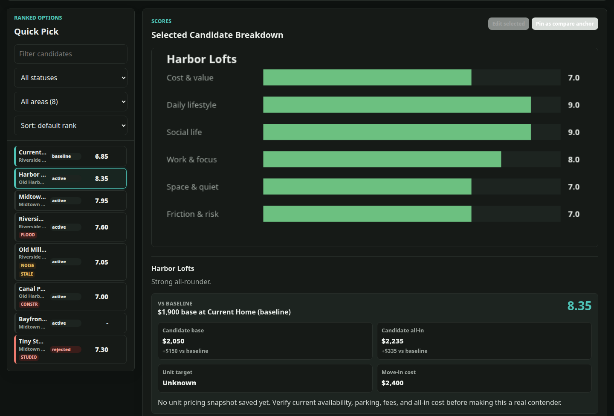

# Housing Decision Agent

**A private, AI-ready assistant for deciding where to live next — or whether to move at all.**

Compare apartments, condos, and houses against *your* budget, commute, and deal-breakers. Every option is scored side-by-side against the home you live in now, so you can see whether a move is actually an upgrade. Use the point-and-click dashboard, the command line, or let an AI coding agent that can run terminal commands (Claude Code, Codex, GitHub Copilot, Cursor, and similar) do the research and data entry for you.

Local-first: your budget, addresses, and preferences stay in plain files on your own computer. No account, no cloud, no tracking.



## Why use it

Apartment hunting usually lives in a messy spreadsheet, fifty browser tabs, and your memory. Listing sites rank by *their* priorities (sponsored, newest, cheapest). This tool ranks by **yours**:

- **"Should I even move?"** Your current home is the baseline. A new place has to beat it on the things you care about, not just be new.
- **True monthly cost.** Rent + required fees + parking, checked against your ideal, soft-ceiling and hard-ceiling budget.
- **Commute and daily life.** Score by minutes to the places you actually go (work, gym, family, school) by walk, bike, transit, or car.
- **Deal-breakers and risks.** Rule out studios, flood-prone parking, heavy construction next door — whatever matters to you. Risks can cap a score instead of silently averaging away.
- **Evidence, not vibes.** Every fact keeps its source link, the date you checked it, and a confidence level. Stale prices get flagged.
- **Explainable scores.** A per-category breakdown shows exactly why one place beats another. Change your weights and preview how the ranking shifts before saving.

Works for apartments, condos, townhomes, and houses in any city. Costs are compared as a monthly all-in figure, so it fits renting best; buyers can enter an estimated monthly cost (mortgage, HOA, taxes, insurance), but there is no built-in loan calculator. Only Miami has a region research pack today; the scoring works anywhere.

## Built for AI agents, too

The `housing` CLI is designed to be driven by an LLM agent with `--json`:

- `housing --json init --questions` tells an agent exactly what to ask you (budget, places, deal-breakers — required vs. optional).
- Agents record facts with sources and dates, score categories with written rationale, and can *propose* preference changes for you to review.
- The dashboard and CLI share the same data, so what your agent adds shows up when you refresh the page.

See [AGENTS_CLI.md](AGENTS_CLI.md) for the rules agents follow (never invent listings or prices; cite sources).

## Quick start

Requires Python 3.11+. No other dependencies.

```sh
git clone <this repository's URL>   # the green "Code" button on GitHub
cd housing-decision-agent
python3 app/server.py          # opens a read-only fictional demo
```

Open the local address it prints. You'll see a sample search for "Alex Example" in the made-up city of Harborview.

Then create **your own** private profile — answer only the questions you want; every one is skippable:

```sh
PYTHONPATH=src python3 -m housing_agent init
python3 app/server.py
```

Or install the `housing` command:

```sh
python3 -m venv .venv && . .venv/bin/activate
pip install -e .
housing init
housing serve
```

Full walkthrough, including what each question means: **[docs/SETUP.md](docs/SETUP.md)**.

## How it works

| Piece | What it does |
|---|---|
| **Profile** (`profile.json`) | Your budget bands, score categories and weights, important places ("anchors"), deal-breakers, risk caps, and how long each kind of fact stays fresh |
| **Candidates** (`candidates/*.json`) | One file per home: **facts** (value + source + date + confidence), **judgments** (0–10 score + rationale), and notes |
| **Scoring engine** | Weighted categories → risk caps → commute adjustments → deal-breaker rejects. Computed fresh every time, never stored |
| **Ledger** (`ledger.jsonl`) | Append-only history of every change and who made it |
| **Dashboard** | Ranking, score breakdowns, side-by-side vs. your current home, preferences editor with live preview, optional map |
| **CLI** | Everything the dashboard does, scriptable, with JSON output for agents |
| **Region packs** (`regions/`) | Local research sources and guidance for a city. `regions/miami/` is a worked example; contributions welcome |

Your profile lives outside the code — in `profile.local/`, any folder passed with `--profile`, or `$HOUSING_PROFILE_DIR` — and is git-ignored, so pulling new versions or contributing never touches your data.

## Privacy

- Runs only on your own machine (`127.0.0.1`). No telemetry, no accounts, no hosted backend.
- Map libraries are bundled. Online map tiles are **off by default**; turning them on contacts OpenStreetMap.
- Your data is ordinary local files. Back them up and protect them like any other personal document.
- If you use an AI agent, whatever it reads is sent to that AI provider.
- To use the dashboard from another device, put your own authenticated VPN or reverse proxy in front of it.

## Documentation

- [Setup guide](docs/SETUP.md) — first run, every profile question explained
- [CLI reference](docs/cli.md)
- [Rules for AI agents](AGENTS_CLI.md)
- [Scoring contract](docs/scoring_contract.md) — exactly how scores are computed
- [Region packs](regions/miami/README.md)
- [Maintainer publication checks](docs/publication.md)

## Development

```sh
python3 -m pytest -q
node --check app/static/app.js
```

Contributions welcome, especially region packs for other cities and new risk/cost checks. See [CONTRIBUTING.md](CONTRIBUTING.md).

## Author

Created by Bryan Totty.

## License

MIT. Bundled browser libraries (Leaflet, Leaflet.markercluster) keep their own licenses alongside the assets.
